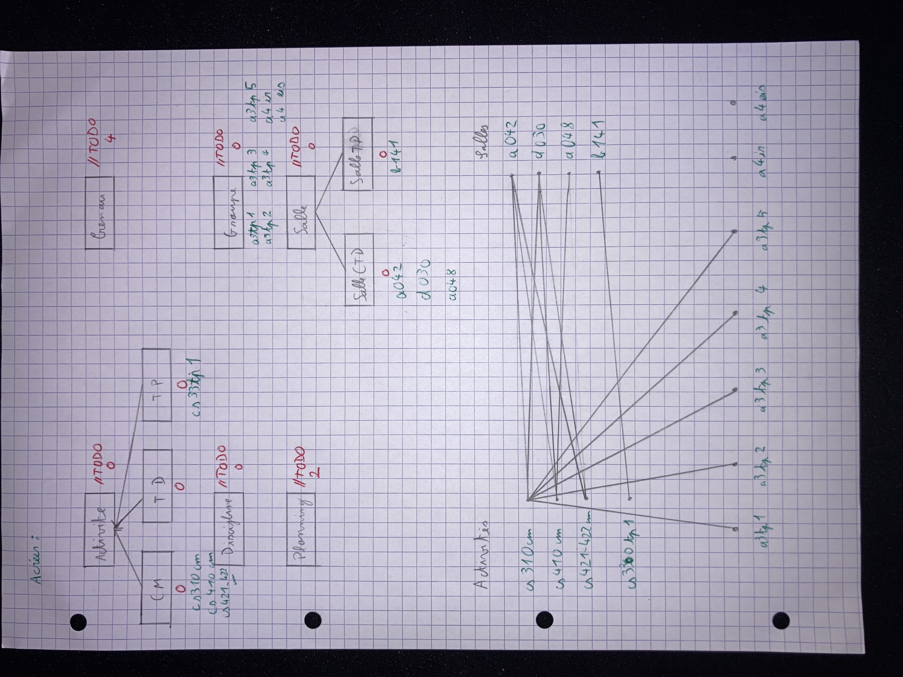

# TP 2 CS312

Class: CS312
Created: 21 mars 2022 10:41
Type: TP

# Compte Rendu TP2

*Léo VALETTE - Romain SERPOLLET*

***Question : Est-il possible de créer une activité pédagogique de type TD et lui associer des salles de TP ?***

**Réponse :** Oui, pour l’instant aucune méthode ne permet de vérifier que les salles que l’on attribue aux activités correspondent. On peut remarquer que les méthodes *addSalle* dans les classes TP, TD et CM n’acceptent que certains types de salles. Mais comme la méthode *addSalle* est aussi définie dans la super classe *Activité* et qu’elle accepte tous les types de salles, alors ça ne pose pas de problème d’associer une salle de TD à un TP.

***Question : Dessiner rapidement le diagramme des classes fournies. Repérer les méthodes non implémentées. Dessiner sans exécuter
 les objets qui devront être créés lors de l'exécution de la partie du main décrite ci-dessous***

**Réponse :** 



***Question : Réaliser la méthode verifDuree, verifSalle et verifCapacité.***

**Réponse :** 

```java
private boolean **verifDuree**(){
    return (((heure*60+minute)>=(8*60)) && ((heure*60+minute+duree)<=(19*60)));
}

//------------------------------------------------------------------------- 

private boolean **verifSalle**(){
	boolean estDedans = false;

	for(Salle salle_ : activite.getSalles()) {
		if(salle_ == salle ) {
			estDedans = true;
		}
	}
	return estDedans;
}

//------------------------------------------------------------------------- 

private boolean **verifCapacite**(){
	int nbEleve = 0;
	for(Groupe gr : activite.getGroupes() ) {
		nbEleve += gr.getEffectif();
	}
	return nbEleve <= salle.getCapacite();
}
```

***Question : Réaliser la méthode intersection, planningGroupe et totalHeuresGroupe.***

**Réponse :** 

```java
public boolean intersection(Creneau c){
	boolean result = false;
	//on verifie que les 2 crenaux sont le même jour
	if((annee == c.getAnnee()) && (mois == c.getMois()) && (jour == c.getJour())) {
		
		//Si les 2 crenaux ont un groupe en commun ou la même salle...
		if(groupeEnCommun(activite.getGroupes(),c.getActivite().getGroupes()) || (salle == c.getSalle())) {
			
			//...on verifie que leurs horaires ne se chevauchent pas
			if((heure*60+minute) >= (c.getHeure()*60+c.getMinute())) {
				result = (c.getHeure()*60+c.getMinute()+c.getDuree() >= heure*60+minute);
			}else {
				result = (c.getHeure()*60+c.getMinute() <= heure*60+minute+duree);
			}
		}
	}
	return result;
}    
  
public boolean groupeEnCommun(ArrayList<Groupe> groupes1, ArrayList<Groupe> groupes2) {
	for(Groupe g: groupes1) {
		if(groupes2.contains(g)) {
			return true;
		}
	}
	return false;
}

//------------------------------------------------------------------------- 

public List<Creneau> planningGroupe(Groupe groupe){
	//Construisons une liste vide:
	ArrayList<Creneau>plan = new ArrayList<Creneau> ();
	Iterator<Creneau> iterateur = edt.iterator();

	while(iterateur.hasNext()) {
		Creneau temp = iterateur.next();
		if(temp.getActivite().getGroupes().contains(groupe)) {
			plan.add(temp);
		}
	}
	return plan;
}

//------------------------------------------------------------------------- 

public float totalHeuresGroupe(Groupe groupe){
	int res = 0;
	for(Creneau c : planningGroupe(groupe)) {
		res += c.getDuree();
	}
	return (float) res/60;
}
```

***Question : Actuellement, rien n'empêche qu'un TP d'automatique se déroule dans une salle de TP d'informatique. Quelles modifications doit-on apporter à l'application pour que les TP d'une discipline donnée ne puissent se dérouler que dans des salles de TP de cette discipline ? (question à rédiger).***

**Réponse :**  Une solution serait de modifier la classe TP. On ajoute une variable Discipline et il suffira de modifier la méthode verifSalle pour vérifier que si l’activité est un TP alors la salle doit être une salle de TP de la même discipline.

Nous avons implémenté cette solution :

```java
private boolean verifSalle(){
	boolean estDedans = false;
	boolean bonneDiscipline = true;
	
	//Ajout de ce if
	if(activite instanceof TP) {
		if(salle instanceof SalleTP) {
			bonneDiscipline = ( ((SalleTP) salle).getType() == ((TP) activite).getType() );
		}
	}

	for(Salle salle_ : activite.getSalles()) {
		if(salle_ == salle ) {
			estDedans = true;
		}
	}
	return estDedans && bonneDiscipline;
}
```

***Question : Dans la réalité, la notion de groupe est plus riche que sa représentation par la classe Groupe. En effet, la totalité de la promotion p2018 constitue un groupe décomposé en groupes de TD et groupes de TP. On peut donc naturellement souhaiter pouvoir introduire cette notion de dépendance (ou appartenance) entre groupes. Par exemple, si a3promo est le groupe associé à l'ensemble de la promotion de 3A et a3tp1 est le premier groupe de TP, la séquence de code suivante ne devrait pas ajouter le créneau c2 dans l'emploi du temps.***

**Réponse :**  Une solution serait de d’ajouter une méthode getParent dans les groupes afin de pouvoir vérifier si deux groupes sont indépendants avant d’ajouter le créneau. Une autre solution serait de créer une super classe *promo* et des sous classes pour les groupes de TP et de TD. Ainsi on créerait des liens de dépendance et on pourrait vérifier qu’il n’y a pas de problème avant d’ajouter le créneau.

## Conclusion :

Dans ce TP, nous avons réalisé une application permettant de “gérer” des emplois du temps simple. 

Nous avons manipulé des classes et sous classes puis abordé la notion d’héritage.